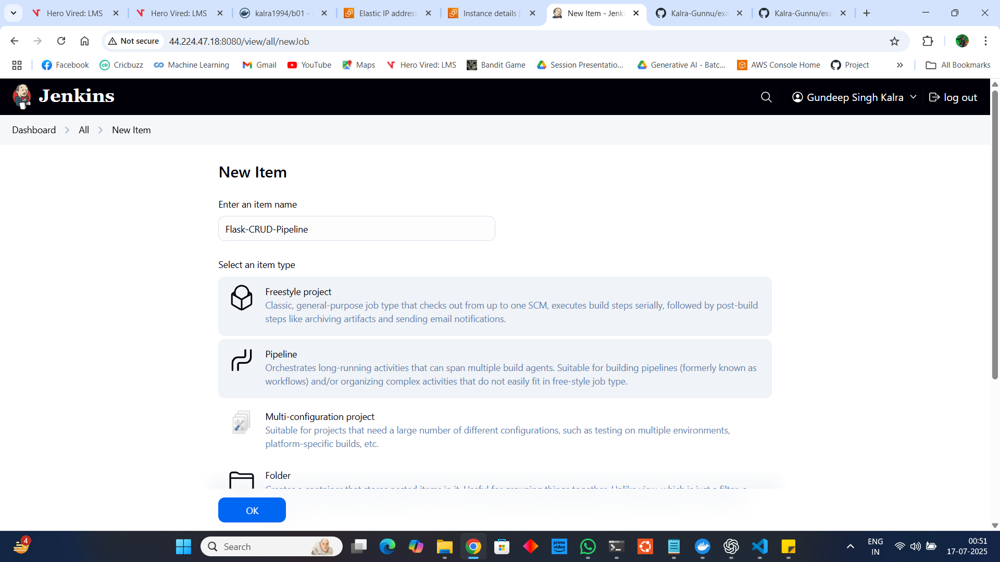

# Flask CRUD App CI/CD with Jenkins on EC2  

This guide demonstrates how to set up **Jenkins** on an AWS **EC2 instance**, configure a **CI/CD pipeline** for a Flask CRUD application, and deploy it using **Gunicorn** and **Systemd** for production readiness.  

---

## Table of Contents  

- [Overview](#overview)  
- [Prerequisites](#prerequisites)  
- [Step 1: Launch EC2 Instance](#step-1-launch-ec2-instance)  
- [Step 2: Connect to EC2 & Update Packages](#step-2-connect-to-ec2--update-packages)  
- [Step 3: Verify Java Installation](#step-3-verify-java-installation)  
- [Step 4: Install Jenkins](#step-4-install-jenkins)  
- [Step 5: Enable & Start Jenkins](#step-5-enable--start-jenkins)  
- [Step 6: Access Jenkins](#step-6-access-jenkins)  
- [Step 7: Jenkins Initial Setup](#step-7-jenkins-initial-setup)  
- [Step 8: Install Required Plugins](#step-8-install-required-plugins)  
- [Step 9: Fork the Flask CRUD App Repository](#step-9-fork-the-flask-crud-app-repository)  
- [Step 10: Clone the Forked Repository](#step-10-clone-the-forked-repository)  
- [Step 11: Allocate & Associate Elastic IP](#step-11-allocate--associate-elastic-ip)  
- [Step 12: Create a Jenkinsfile](#step-12-create-a-jenkinsfile)  
- [Step 13: Add Basic Tests](#step-13-add-basic-tests)  
- [Step 14: Commit & Push Changes](#step-14-commit--push-changes)  
- [Step 15: Configure SSH Access to GitHub](#step-15-configure-ssh-access-to-github)  
- [Step 16: Create a Jenkins Pipeline](#step-16-create-a-jenkins-pipeline)  
- [Step 17: Enable SCM Polling](#step-17-enable-scm-polling)  
- [Step 18: Install Python Virtual Environment](#step-18-install-python-virtual-environment)  
- [Step 19: First Pipeline Build](#step-19-first-pipeline-build)  
- [Step 20: Fix Deployment Stage](#step-20-fix-deployment-stage)  
- [Step 21: Use Gunicorn & Systemd for Deployment](#step-21-use-gunicorn--systemd-for-deployment)  
- [Step 22: Allow Jenkins to Use Sudo](#step-22-allow-jenkins-to-use-sudo)  
- [Step 23: Final Deployment](#step-23-final-deployment)  
- [Final Outcome](#final-outcome)  

---

## Overview  

- **CI/CD** setup with Jenkins on an EC2 instance  
- Automated deployment of a Flask CRUD app  
- Reliable production serving via Gunicorn + Systemd  
- SCM polling for continuous deployment  

---

## Prerequisites  

- AWS account with EC2 access  
- Ubuntu-based EC2 instance (2 GB RAM recommended)  
- Basic knowledge of Linux, Git, and Python  
- Forked Flask CRUD application  
- SSH access to the EC2 instance  

---

## Step 1: Launch EC2 Instance  

Provision an **Ubuntu EC2 instance** with at least 2 GB RAM and open ports **8080 (Jenkins)** and **5000 (Flask)**.  

  

---

## Step 2: Connect to EC2 & Update Packages  

```bash
sudo apt update  
sudo apt upgrade -y
```

Install JDK 17:  

```bash
sudo apt install -y openjdk-17-jre
```

  
  

---

## Step 3: Verify Java Installation  

```bash
java --version
```

  

---

## Step 4: Install Jenkins  

Add Jenkins repository and install it in a single command:  

```bash
curl -fsSL https://pkg.jenkins.io/debian-stable/jenkins.io-2023.key | sudo tee /usr/share/keyrings/jenkins-keyring.asc > /dev/null && echo deb [signed-by=/usr/share/keyrings/jenkins-keyring.asc] https://pkg.jenkins.io/debian-stable binary/ | sudo tee /etc/apt/sources.list.d/jenkins.list > /dev/null && sudo apt-get update && sudo apt-get install -y jenkins
```

  

---

## Step 5: Enable & Start Jenkins  

```bash
sudo systemctl enable jenkins  
sudo systemctl start jenkins
```  

Check Jenkins version:  

```bash
jenkins --version
```

  

---

## Step 6: Access Jenkins  

Open **http://<EC2_PUBLIC_IP>:8080** in your browser.  

Retrieve the initial admin password:  

```bash
sudo cat /var/lib/jenkins/secrets/initialAdminPassword
```

  
  

---

## Step 7: Jenkins Initial Setup  

- Enter the admin password  
- Select **Install Suggested Plugins**  
- Create the first admin user  
- Accept default configurations  

  
  
  
  

---

## Step 8: Install Required Plugins  

Go to **Manage Jenkins → Plugins → Available Plugins** and install plugins such as:  

- Git Plugin  
- Pipeline Plugin  
- SSH Agent Plugin  

  

---

## Step 9: Fork the Flask CRUD App Repository  

Fork the sample **example-flask-crud** repository to your GitHub account.  

  

---

## Step 10: Clone the Forked Repository  

```bash
cd ~  
git clone <your_forked_repo_url>  
ls
```

  

---

## Step 11: Allocate & Associate Elastic IP  

Ensure your EC2 instance has a **static Elastic IP** for consistent deployment.  

  
  

---

## Step 12: Create a Jenkinsfile  

Navigate into the app directory and create a Jenkins pipeline definition:  

```bash
cd <app_name>  
nano Jenkinsfile
```

  

---

## Step 13: Add Basic Tests  

Create a test file `tests/test_app.py` with sample unit tests.  

  
  

---

## Step 14: Commit & Push Changes  

```bash
git add Jenkinsfile tests/test_app.py  
git commit -m "Added Jenkinsfile & tests"  
git push
```

  

---

## Step 15: Configure SSH Access to GitHub  

Generate an SSH key for Jenkins and add it to GitHub → **Settings → SSH Keys**  

```bash
ssh-keygen -t ed25519 -C "your_email@example.com"  
cat ~/.ssh/id_ed25519.pub
```

Test the connection:  

```bash
ssh -T git@github.com
```

Update repo remote & push:  

```bash
git remote set-url origin git@github.com:<username>/<repo_name>.git  
git push origin master
```

  
  
  

---

## Step 16: Create a Jenkins Pipeline  

From Jenkins Dashboard:  

- **New Item → Pipeline**  
- Pipeline from SCM → Git  
- Repo URL: `https://github.com/<your_user>/example-flask-crud.git`  
- Branch: `*/master`  
- Script Path: `Jenkinsfile`  

  
  

---

## Step 17: Enable SCM Polling  

In the Pipeline configuration:  

- **Build Triggers → Poll SCM**  
- Schedule: `H/5 * * * *` (poll every 5 minutes)  

  

---

## Step 18: Install Python Virtual Environment  

```bash
sudo apt-get install -y python3.12-venv 
```

  

---

## Step 19: First Pipeline Build  

Trigger the pipeline manually.  

  

Initially, the Flask app won’t stay running because `nohup flask run` exits after the job finishes.  

  

---

## Step 20: Fix Deployment Stage  

Update the Jenkinsfile to properly detach the Flask process using `disown`.  
A new SCM poll triggers an automatic build.  

  

---

## Step 21: Use Gunicorn & Systemd for Deployment  

Instead of running Flask directly, use **Gunicorn** with a **Systemd service**:  

```ini
[Unit]
Description=Flask CRUD App
After=network.target

[Service]
User=jenkins
Group=jenkins
WorkingDirectory=/var/lib/jenkins/workspace/Flask-CRUD-Pipeline
ExecStart=/var/lib/jenkins/workspace/Flask-CRUD-Pipeline/venv/bin/gunicorn --workers 2 --bind 0.0.0.0:5000 crudapp:app
Restart=always
Environment="PATH=/var/lib/jenkins/workspace/Flask-CRUD-Pipeline/venv/bin"

[Install]
WantedBy=multi-user.target
```

Reload & restart services:  

```bash
sudo systemctl daemon-reexec  
sudo systemctl restart flaskcrud  
sudo systemctl status flaskcrud
```

  

---

## Step 22: Allow Jenkins to Use Sudo  

Edit the sudoers file:  

```bash
sudo visudo
```

Add:  

```bash
Defaults:jenkins !requiretty
jenkins ALL=(ALL) NOPASSWD: /bin/systemctl restart flaskcrud, /bin/systemctl status flaskcrud, /bin/systemctl enable flaskcrud
```

Then rerun the pipeline manually.  

  

---

## Step 23: Final Deployment  

Run the pipeline again. The Flask app is now successfully running at:  

**http://<Elastic_IP>:5000**  

  

---

## Step 23: Configuring E-mail Notification

Go to Manage Jenkins -> System and scroll down to E-mail Notification section and give below details

- SMTP server: smtp.gmail.com
- Check Use SMTP Authentication
- Username: <example@gmail.com>
- Password: Gmail App password(which is different from the regular Gmail password)
- Check Use SSL
- SMTP Port: 465
- Check Test Configuration
- Test e-mail recipient: <example@gmail.com>
- Click Test configuration

 
 
 

---

## Step 24: Modify the Jenkinsfile with below content

```bash
    post {
        success {
            emailext(
                to: 'gundeepgunnu@gmail.com',
                subject: "✅ SUCCESS: ${env.JOB_NAME} #${env.BUILD_NUMBER}",
                body: "The build succeeded!\nCheck details: ${env.BUILD_URL}"
            )
        }
        failure {
            emailext(
                to: 'gundeepgunnu@gmail.com',
                subject: "❌ FAILED: ${env.JOB_NAME} #${env.BUILD_NUMBER}",
                body: "The build failed!\nCheck logs: ${env.BUILD_URL}"
            )
        }
    }
```
Now commit these changes, a new build gets triggered


---

## Step 25: Receive E-mail Notification


## Final Outcome  

✅ Fully automated CI/CD pipeline with Jenkins  
✅ Flask app deployed via Gunicorn + Systemd  
✅ SCM polling triggers auto-deployment
✅ Receive E-mail Notification on Success/Failure of Pipeline  

🎉 **Every push to the repo automatically builds and deploys the app!**  

---
 
